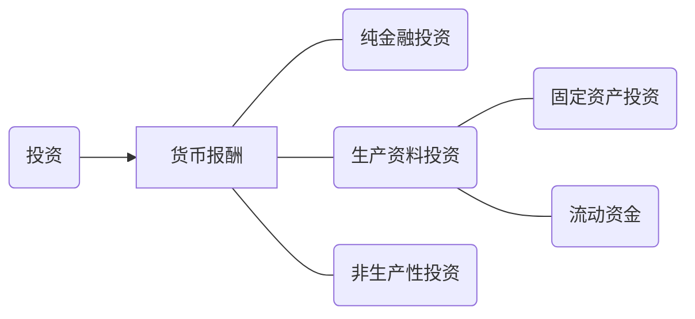

## 绪论

### 一、课程性质及在项目生命周期中的地位
    
《建设项目评估》是工程管理专业的一门不可或缺的专业课程，它主要针对工程项目前期管理这个环节，提高建设项目投资决策科学化、规范化和民主化水平，对政府、企事业单位投资经营和运作管理提供指导意义和促进作用。

### 二、课程学习内容及要求
+ 项目建设背景及必要性论证
+ 市场分析与生产规模的确定
+ 项目生产建设条件及技术分析
+ 投资估算及资金筹措
+ 项目财务评价（生产成本、收入、盈利能力、偿债能力等分析）
+ 项目经济分析
+ 投资项目方案比选
+ 投资风险与不确定性分析
+ 项目社会评价、环境影响评价、项目后评价

要求：熟练掌握项目评价的内容、方法及编制报告格式，尤其掌握建设项目经济评价的内容和方法实务。学完课程后具备编制可行性研究报告和项目评估报告的初步能力。

### 三、与该课程联系紧密的就业方向

+ 工程咨询服务行业

    编制项目建议书、项目可行性研究报告、项目评估报告

+ 与投资建设相关的各类型企业（与投资相关的部门）

    房地产公司投资部

    XXX投资产业集团（公司）

+ 银行或政府投资决策部门

    技术经济分析、项目评估

### 四、与本课程内容相关的职业资格考试
   
注册咨询工程师考试（项目投资与决策分析）

注册造价工程师、监理工程师考试 

### 五、与本课程相关的参考书、工具

国家发改委、建设部

《建设项目经济评价方法与参数》（第三版）

用EXCEL辅助计算 

 ## 导论

 ### 1.1 投资项目与投资决策

 #### 1.1.1 投资

##### 投资的特点

投资是指经济主体为未来获得收益而现时投入生产要素，以形成资产的一种经济活动；投资也可解释为投资主体为未来获得收益而现时投入资金或资本。

1、投资是由投资主体进行的一种有意识的经济活动（投资主体）。

2、投资活动的目的是为了获取一定的预期效益，且这种预期收益是不确定的（投资目的）。

3、投资需通过特定的手段和方式，且手段和方式多种多样（投资手段）。

4、投资是一个收益和风险性并存的发杂的行为过程（投资行为过程）。

投资具有收益性、风险性、长期性。

##### 投资分类

+ 投资按其性质的不同，可分为固定资产投资、无形资产投资和流动资金。

+ 投资按其运用形式和投入行为的程度不同，可分为直接投资和间接投资。

+ 投资按其投资期限的长短，可分为长期投资和短期投资。

+ 投资按其用途的不同，可分为生产性投资和非生产性投资。

###### 固定资产投资：

即建设和形成固定资产的资金。固定资产是指能在较长时间里）长于1年或1个生产周期）反复使用，并在其使用过程中保持原有物质形态，其价值逐渐地、部分地转移到产品中去的劳动资料和其他物质资料，如房屋，建筑物，机械设备，运输设备等。

两个标准：
+ 使用期限在一年以上或长于一个生产周期；
  
+ 单位价值达到规定的标准。

通过折旧来补偿。

###### 无形资产投资：

无形资产指能长期地为使用者发挥作用但不具备实物形态的资产，如土地使用权，专利权，非专利技术，商标，商誉等。

###### 流动资金

流动资金是指在生产过程中，垫支在流动资产上的资金；流动资产是指不断地改变其物质形态、其价值一次性转移到产品中的资产，如原材料、燃料、在产品等。

###### 直接投资：
投资者直接将货币资金投入到投资项目及资产，并拥有被投资对象的经营控制权的投资。

###### 间接投资：
投资者以其货币资金购买金融资产，以其获取一定收益的投资。也称证券投资。

#### 1.1.2 投资项目的分类

    
    

