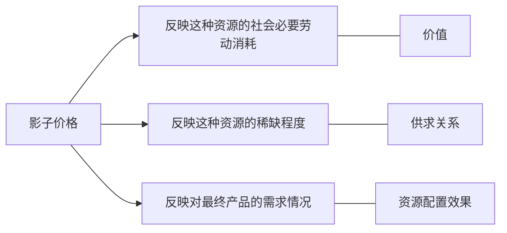

## 10.1 国民经济效益评估概述

### 10.1.1 项目国民经济评价的概念

国民经济效益评估是按照资源合理配置的原则，从国家整体角度考察项目的效益和费用，用货物影子价格、影子工资、影子费率和社会折现率等经济参数分析、计算项目对国民经济的净贡献，评估项目的经济合理性，为项目的投资决策提供依据的过程。

在市场经济条件下，企业财务评价可以反映出建设项目给企业带来的直接效果，但由于市场失灵现象的存在，财务评价不可能将建设项目产生的效果全部反映出来。因此，正是由于国民经济评价关系到宏观经济的持续健康发展和国民经济结构布局的合理性，所以说国民经济评价是非常必要的。

### 10.1.2 项目国民经济评价的作用

+ 国民经济效益评价是宏观上合理配置资源的需要
+ 国民经济效益评价是真实反映项目对国民经济净贡献的需要
+ 国民经济评价有利于项目投资决策科学化

### 10.1.3 项目国民经济评价的范围

1. 铁路、公路等交通运输项目；
2. 较大的水利水电项目；
3. 国家控制保护资源的项目；
4. 较大的外资、中外合资项目；
5. 主要产出物和投入物的价格严重扭曲的项目

### 10.1.4 国民经济效益评估与企业财务效益评估的关系

#### 联系

企业财务效益评估是国民经济效益评估的基础和前提，国民经济效益评估是企业财务效益评估的完善与深化，二者的主要联系表现为都是对项目成本效益的分析评价，企业财务效益评估所用的数据，加工整理后便构成国民经济效益评估的数据，评估的方法也大致相同。

#### 区别

**评价角度的不同**

财务评估是从企业角度分析项目的财务效果，偏重于项目的盈利水平及偿债能力的评价。

国民经济评估从国家角度评价拟建项目对国民经济所产生的效应，偏重于对社会产生的净效益和纯收入的分析，它不但要评估项目对国民经济的贡献，还应分析国民经济为项目所付出的代价。

**评价任务的不同**

企业财务效益评估为项目选定和规模方案的选择提供财务数据，不能为重大项目的决策服务，主要关心项目的筹资来源和还本付息能力。

国民经济效益评估用于拟建项目的择优及拟建项目生产规模的选择, 是重大项目决策的主要依据，主要关心项目是否应当兴建, 以及拟建项目应有多大的生产规模。

评价项目费用与效益范围划分的不同：

企业财务效益评估将项目的全部支出都作为费用, 列为项目的成本或项目的资金流出。

而国民经济效益评估将其中的转移支付(如, 税金、补贴、利息) 扣除
国民经济效益评估不考虑已经发生的沉没成本。

因此, 在进行国民经济效益评估时应对成本与效益的内容进行鉴别, 使它们评估的内容能体现各自的角度。

**评价使用价格体系的不同**

在企业财务效益评估中, 投入和产出物以市场价格为基础计价。

在国民经济效益评估中, 要用既能反映投入产出物的价值, 又能反映这种资源稀缺程度的影子价格进行评估。

影子价格是对资源进行最优配置的一种价格。

在国民经济效益评估中, 一般的通货膨胀不予考虑，而企业财务效益评估则必须考虑通货膨胀的影响。

**依据评价参数的不同**

在企业财务效益评估中, 采用国家颁发的各行业的基准内部收益率 做为评价项目经济效益的依据。

在国民经济效益评估中, 使用统一的理论利率, 即, 称为社会折现率或经济折现率。

对于涉及进出口的物品，企业财务效益评估要运用法定汇率或挂牌汇率，国民经济效益评估要运用影子汇率。

企业财务效益评估中, 其基本资料是根据财务数据编制的财务现金流量表，国民经济效益评估, 其基本资料是根据影子价格编制的国民经济效益费用流量表。

**评价对象的不同**

一般对于没有收入的项目, 不进行财务效益评估，如防洪工程、环保工程、水土保持工程等。

无论有无财务收入, 一些重大的有关国计民生的项目, 投入/产出物财务价格明显不合理的项目, 特别是对：

+ 能源、交通基础设施 和 农林水利项目
+ 某些国际金融组织的贷款项目
+ 某些政府贷款项目

应按要求进行国民经济效益评估。

另外, 财务评价有两个方面， 一是盈利能力分析，另一是清偿能力分析。
国民经济评价仅做盈利能力分析, 不做清偿能力分析。

#### 评价结果的分析

财务评价可行, 国民经济评价也可行：项目可行

财务评价不可行, 国民经济评价可行：

一是重新考察投资方案, 改进使之财务上可行；

如果该项目是关系到国计民生, 对国家有重大意义的项目, 采用国家给项目企业补贴的办法, 弥补项目财务上的不可行；

财务评价可行, 国民经济评价不可行：项目不可行。

这时候可以改进项目, 使项目的国民经济评价也可行, 或者放弃该项目。

财务评价不可行, 国民经济评价为不可行：项目不可行。

### 10.1.5 国民经济效益评估的研究内容
1. 识别国民经济效益(收入)与费用(支出)
2. 计算和选取影子价格
3. 编制国民经济评价报表
4. 计算国民经济评价指标进行方案比选

### 总结

本节内容小结

Ａ. 出发点 —— 国家宏观角度

Ｂ. 评价原则 —— 资源的合理配置

Ｃ. 评价参数 —— 影子价格、影子工资、影子汇率和社会折现率

Ｄ. 评价内容 —— 项目给国民经济带来的净效益

Ｅ. 评价目的 —— 评价项目的经济合理性

Ｆ. 作用 —— 为项目投资决策提供依据

国民经济与财务评估的不同？

+ 评价的角度、任务、划分的范围不同
+ 评价使用的价格体系、指标参数、评价对象不同

国民经济效益评估的作用、范围？

国民经济效益评估的内容：
1. 识别国民经济效益(收入)与费用(支出)
2. 计算和选取 影子价格
3. 编制国民经济评价报表
4. 计算国民经济评价指标进行方案比选

## 10.2 国民经济评估的费用与效益

### 10.2.1 项目国民经济费用与效益的内涵
项目国民经济费用

项目国民经济费用，是指项目存在而使国民经济所付出的代价。

项目国民经济效益

项目国民经济效益，是指项目对国民经济所作的贡献。

### 10.2.2 项目国民经济费用和效益的识别

国民经济费用与效益识别的基本原则

1. 国家原则——对项目的收支活动都应从国家或国民经济角度出发，看其是否花费了社会资源，是否真正产生了效益。

2. 边际原则——对项目国民经济费用和效益的分析，应观察费用增加额、效益增加额与产量增加额的增量比例。

项目国民经济效益费用的识别

1. 项目国民经济效益的识别

**直接效益的识别：**　

直接效益是指由项目产出物产生并在项目范围以内以影子价格计算的经济效益。

项目投产以后增加总的供给量, 即增加了国内的最终消费品或中间产品, 此时直接效益表现为：增加该产出物数量满足国内需求的效益。

项目投产以后减少了其他相同或类似企业的产量, 即整个社会没有增加产品的数量. 只是代替了其他相同或类似企业的等量产品，项目的直接效益是减少国家有用资源 耗费 (或损失) 的效益。

增加出口或减少进口的产出物

增加出口就是项目投产以后增加国家出口产品的数量, 其效益是：增加出口所增收的国家外汇。

减少进口是指项目投产以后, 其产品可以替代进口产品, 其效益是：减少进口所节约的外汇效益。

**直接费用的识别**
直接费用 是项目使用投入物所产生并在项目范围内以影子价格计算的 经济费用。

直接费用表现为：
+ 其他部门为供应本项目投入物而扩大生产规模所耗用的资源费用
+ 或表现为减少对其他项目(或最终消费者)投入物的供应而放弃的效益
+ 增加进口或减少出口
  + 增加进口是指因为项目存在, 国家不得不为增加进口而多支付的外汇
  + 减少出口指因项目使用了国家用来出口的商品, 其费用是国家因减少出口而损失的外汇收入

**间接效益的识别**
间接效益（亦称外部效益）是指由项目引起的但在直接效益中未得到反映的那部分效益。即项目为社会做出了贡献，而项目本身并未得益的那部分效益，即由于项目存在而使项目以外的主体所享有的利益。

如, 在建设一个钢铁厂的同时, 又修建了一套厂外运输系统, 它除了
为钢铁厂服务外，还使当地的工农业生产和人民生活得益。这部分效益即为钢铁厂的外部效益。

又如, 某水泵厂生产一种新型节能水泵。用户可得到较低的运行费用的好处, 但未能反映到水泵厂的直接效益中；因此, 这部分节能效益也是水泵厂的外部效益。

**间接费用的识别**　
间接费用（亦称外部费用）是指由项目引起的, 而在项目的直接费用中未得到反映的那部分费用。即社会为项目付出了代价，项目本身并不需要支付的那部分费用，即由于项目存在而使项目以外的主体所造成的全部损失。
例如：
工业项目产生的废水、废气和废渣引起的环境污染及对生态平衡的破坏, 项目并不支付任何费用, 而国民经济付出了代价，如何评估这部分费用？
这种外部费用较难计算, 除按环保部门规定征收的排污费计算外，也可以用被污染的农作物和江河湖泊的水产品或森林的价值损失评估项目污染和对生态破坏所造成的损失。

如果环境污染给国民经济造成的损失很明显, 且难以计量, 则可根据国家的控制污染要求进行定性分析。

项目的间接效益和间接费用统称为**项目的外部效果**。

**外部效果的计算**
外部效果的计算应考虑环境及生态影响效果、技术扩散效果和产业关联效果。

对显著的外部效果能定量的要做定量分析, 计入项目的效益和费用。不能定量的, 应做定性描述。为防止计算外部效果的扩大化, 项目的外部效果只计算一次相关效果, 不应连续扩展。

一般情况下考虑以下外部效果:
+ 环境及生态影响效果：“三废”造成的环境污染和生态的破坏，是一种间接费用。
+ 技术扩散效果：包括技术培训和技术推广等, 一种间接效益。
+ 产业关联效果：对上、下游企业的关联效果
  + 对“下游”：是指生产初级产品的项目对以其产出物为原料的经济部门产生的效果。
  + 对“上游”：是指一个项目的建设会刺激那些为该项目提供原材料或半成品的经济部门的发展。

**转移支付**

转移支付是指财务效益评估中某些费用和效益以货币形态在项目与社会经济实体之间相互转移，而不同时发生资源相应变动的经济现象。

项目的某些财务收益和支出, 从国民经济角度看, 并没有造成资源的实际增加或者减少，是国民经济内部的“转移支付”, 不能计做项目的国民经济效益或费用。
+ 国家和地方政府的税收, 仅是从项目转移到政府
+ 国内银行借款利息, 仅是从项目转移到金融机构
+ 国家或地方政府对项目的补贴, 仅是从政府转移到项目
+ 土地费用是项目建设征购土地的实际支付，是项目转移给地方政府、村镇集体、其他企业或农民的货币资金。故在国民经济评价时也不列作费用，应列作费用的是被占用土地的机会成本和使国家新增的资源消耗。
        
如果以项目的财务评价为基础进行国民经济评价时，应从财务效益和费用中剔除其中的转移支付部分。

**利息**

+ 国内贷款的还本付息。仅代表资源支配权的转移。
+ 国外贷款的还本付息。处理分以下三种情况：
  + 评价国内投资经济效益的处理办法。在分析时，由于还本付息意味着国内资源流入国外，因而应当视作费用。
  + 国外贷款不指定用途时的处理办法。这种情况下，与贷款对应的实际资源虽然来自国外，但受贷国在如何有效利用这些资源的问题上，面临着与国内资源同样的优化配置任务，因而应当对包括国外2、贷款在内的全部资源的利用效果作出评价。在这种评价中，国外贷款还本付息不视作收益，也不视作费用。
+ 国外贷款指定用途的处理办法。如果不上拟建项目，就不能得到国外贷款，这时便无须进行全投资的经济效益评价，可只进行国内投资资金的经济评价。这是因为，全投资经济效益评价的目的在于对包括国外贷款在内的全部资源多种用途进行比较选优，既然国外贷款的用途已经唯一限定，别无其他选择，也就没有必要对其利用效果作出评价了。

**费用和效益的鉴别与计算应注意的几个问题**

+ 考虑项目“有”或“没有”条件下投入和产出之间的差别   
+ 区分不同的投入物（或产出物）所带来的费用（或效益）状况   
+ 对外部效果的鉴别作充分的论证，弄清是否真正为项目所产生的    
+ 在鉴别时只考虑和所评估项目直接有关的外部效果

### 10.2.3 国民经济效益评估的方法

财务评价基础上的国民经济评价是在财务评价基础上, 通过对评价参数的调整, 将这些参数调整成为宏观的, 较为理想的水平进行的评价。

扩大范围的国民经济评价的基本思路是：扩大评价的范围, 使原来财务评价中不能反映的间接费用和间接效益包含到这个大的范围内。

这个扩大范围的项目就相当于一个“新的评价项目”， 采用影子价格、影子工资、影子汇率、社会折现率对整个项目的费用和效益进行评价。

### 10.2.4 国民经济效益评估的步骤

**在财务效益分析的基础上进行国民经济效益分析的步骤**
  1. 效益和费用范围的调整
    1. 剔除已计人财务效益和费用中的转移支付。
    2. 识别项目的外部效益和外部费用，对能定量的应进行定量计算，不能定量的，应作定性描述。
   
  2. 效益和费用数值的调整
    1. 建设投资的调整。
    2. 流动资金的调整。
    3. 经营费用的调整。
    4. 销售收入调整。
    5. 在涉及外汇借款时，用影子汇率计算外汇借款本金与利息的偿付额。
   
  3. 编制表格与计算指标
    1. 编制项目的国民经济效益费用流量表（全部投资），并据此计算全部投资的经济内部收益率和经济净现值指标。
    2. 对使用国外贷款的项目，还应编制国民经济效益费用流量表（国内投资），并据此计算国内投资的经济内部收益率和经济净现值指标。
    3. 对于产出物出口（含部分出口）或替代进口（含部分替代进口）的项目，要求编制经济外汇流量表、国内资源流量表，计算经济外汇净现值、经济换汇成本或经济节汇成本。

**直接进行国民经济效益分析的步骤**
  1. 识别和计算项目的内部效益。
  2. 用货物的影子价格、土地的影子费用、影子工资、影子汇率、社会折现率等参数直接进行项目的投资估算。
  3. 流动资金估算。
  4. 根据生产经营的实物消耗、用货物的影子价格、影子工资、影子汇率等参数计算经营费用。
  5. 识别项目的外部效益和外部费用，对能定量的应进行定量计算，对难于定量的，应作定性描述。
  6. 编制有关报表，计算相应的评价指标。

### 本节内容小结

国民经济 效益/费用 的识别
+ 直接效益由项目产出物产生并在项目范围以内以影子价格计算的经济效益
  + 增加总的供给、减少投入物
  + 增加出口、减少进口
+ 直接费用是项目使用投入物所产生并在项目范围内以影子价格计算的经济费用
  + 所耗用的资源的费用、减少对其它项目的投入而损失的效应（机会成本）

+ 间接效益由项目引起的但在直接效益中未得到反映的那部分效益
  + 环境及生态影响效果      
  + 技术扩散效果和产业关联效果
  
+ 间接费用（外部费用）是指由项目引起的, 而在项目的直接费用中未得到反映的那部分费用
  + “三废”引起的环境污染 
  + 对生态平衡的破坏
+ 转移支付：项目的某些财务收益和支出, 从国民经济角度看, 并没有造成资源的实际增加或者减少。
  + 税收、利息、政府的补贴等
+ 国民经济效益评估的方法
  + 财务基础上的和扩大范围的国民经济效益评估

## 10.3 国民经济效益评估的收入费用项目调整

国民经济效益评估中收入、费用项目调整

**投资项目的调整**
+ 调减项目 （支出）
  + 国内借款的建设期利息
  + 固定资产投资方向调节税
+ 调增项目（支出）
  + 项目增加的外部投入等

**项目成本的调整**
调减项目(不应考虑为成本)：

转移支付：包括销售税金、进口关税、利息等

**项目收入的调整(不应为项目的收入)**

调减项目 —— 国家给予企业的收入补贴

调增项目 —— 所得税等

**影子价格**
影子价格，从理论上来说，是指资源在最有利用情况下，单位（资源的利用单位）效益增量价值。

它是20世纪30年代末40年代初由荷兰数理经济学家、计量经济学创始人詹恩·丁伯根和前苏联数学家、经济学家、诺贝尔经济学奖获得者康特罗维奇最先提出的。

影子价格又称“最有计划价格”。它是为实现一定的经济发展目标而人为确定的、比交换价格更能反映出合理利用资源效率的价格。从定价原则来看，它不仅能更合理反映出产品价值，而且还能反映社会劳动消耗、市场的供求关系和资源的稀缺程度；从其产生的效果来看，它有利于资源的优化配置。因此，影子价格是人们对所利用的资源的一种评价，而不是一种真正意义上的商品价格。

**影子价格的含义**
概念：指当社会经济处于某种最优化状态下时, 能够反映社会劳动的消耗、资源稀缺程度和对最终产品需求情况的价格。

影子价格有三种理论。

+ 资源最优配置理论
+ 机会成本和福利经济学理论
+ 全部效益和全部费用理论 (边际效益)

**项目投入物、产出物影子价格的确定依据**
+ 在销售收入、销售成本、投资成本中占较大比重的投入物和产出物
+ 可以参与进出口贸易的投入物和产出物
+ 国内价格和国际价格有较大差距的投入物和产出物
+ 政府或上级部门已有规定的影子价格或转换系数的投入物和产出物

项目投入物和产出物的分类
+ 外贸货物
+ 非外贸货物
+ 特殊投入物  
+ 资金
+ 外汇

+ 外贸货物是指其生产、使用将直接或间接影响国家进出口水平的货物。
+ 非外贸货物是指其生产或使用将不影响国家进出口水平的货物。
+ 特殊投人物包括劳动力和土地。

**外贸货物影子价格确定方法**

外贸货物是指生产和使用会直接或间接影响国家进出口水平的货物。外贸货物影子价格的确定基础是国际市场价格。

外贸货物中的进口品应满足（否则不应进口）：国内生产成本 > 到岸价

外贸货物中的出口品应满足（否则不应出口）：国内生产成本 < 到岸价 

+ 产出物（以出厂价计）的定价方法
  1. 直接出口的产出物
  2. 间接出口的产出物   
  3. 替代进口的产出物   
+ 投入物（以进厂价计）定价方法
  1. 直接进口的投入物   
  2. 间接进口的投入物   
  3. 减少出口的投入物

投入物

直接进口产品（国外产品）
$$
影子价格  =  \text{CIF}(到岸价格) \times \text{SER}影子汇率 + 项目到口岸的国内运费和贸易费用
$$

影子汇率（SER）是指外汇的影子价格。它体现从国家角度对外汇价值的估量，在投资项目国民经济评估中用于外汇与人民币之间的换算。同时，它又是经济换汇或节汇成本的依据。

国民经济评估中的贸易费用是指物资系统、外贸公司和各级商品批发站等部门花费在货物流通过程中的以影子价格计算的费用。

例1：项目使用的某种原材料为进口货物, 其到岸价格为 100美元/单位, 项目离口岸 500公里。该材料影子运费为 0.20元/单位公里, 贸易费用为货价的 6%。外汇的官方汇率为 8.27(下同), 影子汇率调整系数为 1.08。
试计算该投入物 (原材料) 的影子价格。

解：

$$
\begin{align*}
影子价格 &= \text{货物到岸价
}(100 \times 8.27 \times 1.08 )+ 运输费（500 \times 0.2)+ 贸易费 (100 \times 8.28 \times 1.08 \times 6\%)\\ &= 1046.75（元/单位）
\end{align*}
$$

**间接进口产品**
$$
影子价格 = CIF(到岸价格) \times 影子汇率 + 口岸到原用户的运输及贸易费 - 供应厂到用户的运输及贸易费 + 供应厂到项目的运输及贸易费
$$

